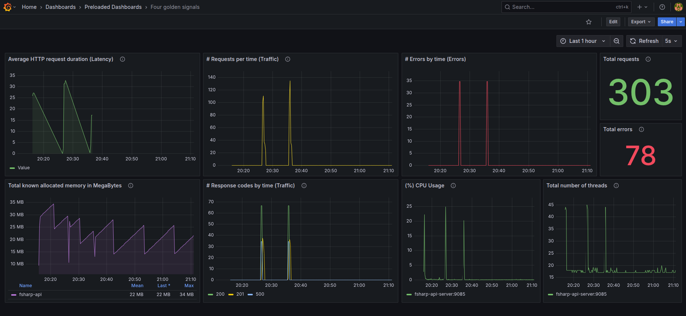

# Monitoring F# API

This project consists in a F# REST API to exemplify how to work with Prometheus,
Grafana, AlertManager, and other monitoring and alerting tools. To make the
connection between this .NET project and the Prometheus server, we're using the
[prometheus-net](https://github.com/prometheus-net/prometheus-net) package.

+ Related project :: [64J0/dotnet-builtin-metrics](https://github.com/64J0/dotnet-builtin-metrics).

### Project components

In this project we're going to use the following tools and components:

* FSharp API
  * Using ASP.NET and Giraffe
  * prometheus-net
* Prometheus
* Grafana

## What should we monitor?

For this project, I'm considering the four golden signals, as defined at
Google's SRE book: [link](https://sre.google/sre-book/monitoring-distributed-systems/#xref_monitoring_golden-signals).

> The four golden signals of monitoring are latency, traffic, errors, and
> saturation. If you can only measure four metrics of your user-facing system,
> focus on these four. [...] If you measure all four golden signals and page a
> human when one signal is problematic (or, in the case of saturation, nearly
> problematic), your service will be at least decently covered by monitoring.

The following table presents how we can get each signal information with this
current code configuration:

| Signal     | Description                                            | How to get               |
|------------|--------------------------------------------------------|--------------------------|
| Latency    | The time it takes to service a request (service time). | `requestDuration`1,2     |
| Traffic    | HTTP requests per second.                              | `requestCounter`1        |
| Errors     | The rate of requests that fail.                        | Combination of both      |
| Saturation | How "full" your service is.                            | Other Prometheus metrics |

1. Notice that `requestDuration` and `requestCounter` are the custom middlewares
   defined at the API.
2. Even though the Google SRE book uses the latency for the signal, I decided to
   use the response time. Check the following definition to better understand
   this difference:
   
   > [...] The response time is what the client sees: besides the actual time to
   > process the request (the service time), it includes network delays and
   > queueing delays. Latency is the duration that a request is waiting to be
   > handled - during which it is latent, awaiting service.
   > 
   > --- Designing Data-Intensive Applications.

## How to run?

### How to run the containerized project?

Make sure you have the following tools installed:

* `Docker version 28.1.1`
* `Docker Compose version v2.35.1`

Then, you can use the following commands:

```bash
# Option 1:
#
docker compose up -d

#
# ===============================================================
#

# Option 2:
#
# If you don't want to use the `docker compose' command, you can, first
# build the docker image for the API
docker build -t fsharp-api:v1 .

# Then, you can run the API in a standalone container
docker run -d -p 8085:8085 -p 9085:9085 fsharp-api:v1
```

While this project is running, you can visit `http://localhost:9090` and start
checking the metrics for the API from the Prometheus interface. The
docker compose configuration for the Prometheus service was mainly inspired by
[this reference](https://github.com/vegasbrianc/prometheus/blob/master/docker-compose.yml).

+ Notice that the API base image is a chiseled variant. If you're not aware of
  what this means, I highly recommend taking a look at this article from
  Microsoft's DevBlogs: [link](https://devblogs.microsoft.com/dotnet/announcing-dotnet-chiseled-containers/).

#### Dashboards

When the Grafana container starts, it's configured to automatically connect to
the Prometheus data source and load two dashboards. You can access the Grafana
platform through the `http://localhost:300` address.

The first time you log in you can use the "default" credentials:

- Username :: admin
- Password :: admin

Notice that the UI will ask you to change the password, but you can just skip
this for now.

Sample:



### How to run the API locally?

For further improvements in the API code, I recommend running the project with a
local .NET SDK, since it's faster to iterate through the changes.

* .NET SDK version: 9.0.xxx

```bash
# Use this command to list .NET SDKs installed
dotnet --list-sdks
```

Next step is to install the required dependencies, using the following commands:

```bash
# 1. Get inside the API directory
cd fsharp-api/

# 2. Restore nuget packages
dotnet restore

# 3. Build the project
dotnet build

# 4. Start the server
dotnet run
# watch mode for development
# dotnet watch run
```

## How to test it manually?

This API consists in basically 3 endpoints:

- GET `/health`
- GET `/ping/%s`
- POST `/api/prediction`

And you can test them manually with the following commands:

```bash
# 1. Health endpoint
curl localhost:8085/health
# Response:
# {"message":"API instance is healthy!"}

# =================================

# 2. Ping endpoint
curl localhost:8085/ping/foo
# Response:
# {"message":"Pong from foo!"}

# =================================

# 3. Prediction endpoint
curl -X POST \
    -H "Accept: application/json" \
    -d '{"id":1, "crimesPerCapta":0.01}' \
    localhost:8085/api/prediction
# Response:
# {"message":"OK","id":1,"crimesPerCapta":0.01,"pricePrediction":27.148331825982115}
```

You can later see the metrics by visiting `http://localhost:9085/metrics` in
your browser.

## Load test

To check how the API behaves under a stress scenario, I added this simple load
test based on [NBomber](https://nbomber.com/docs/getting-started/overview/). One
can trigger it using:

```bash
make load-test
```

For an example report check [this file](./reports/2025-06-01_22.35.12_session_d631a701/nbomber_report_2025-06-01--22-39-02.md).

If you want to check how the system resources are being used, go for the next
section on resource allocation.

## Resource allocation

Since this project uses a bunch of other services, I decided to limit the
resources allocated for them. If you notice that some piece is not working
properly, make sure to test other values for those resources (CPU and Memory).

If you want to check how much resources your containers are currently consuming,
you can use the following command in the terminal:

```bash
# Check the resources usage for the containers in real time
docker stats
```

Example:


