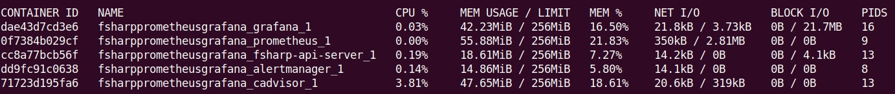

# Monitoring F# API

:warning: Work in progress!

This project consists in a simple F# REST API to exemplify how to work with
Prometheus, Grafana, AlertManager, and other tools. To make the connection
between this .NET project and the Prometheus server, we're using the
[prometheus-net](https://github.com/prometheus-net/prometheus-net) tool.

Along with this code, I'm also writing an article that later will be posted in
my blog to explain the core concepts of each tool used, with more details
regarding the API built.

## Project components

In this project we're going to use the following tools and components:

* FSharp API
* Prometheus
* Alertmanager
* cAdvisor
* Grafana

## How to run the containerized project?

Make sure you have the following tools installed:

* `Docker version 20.10.22`
* `docker-compose version 1.29.1`

Then, you can use the following commands:

```bash
# recommended process using `docker-compose'
docker-compose up -d

# if you don't want to use the `docker-compose' command, you can, first
# build the docker image for the API
docker build -t fsharp-api:v1 .

# you can run the API in a standalone process, although this is not
# my recommended process. Use the `docker-compose' command instead.
docker run -d -e HOST="0.0.0.0" -p 8085:8085 fsharp-api:v1
```

When this project is running you can visit `http://localhost:9090` and start
grabbing the metrics for our project from the Prometheus interface. The
docker-compose configuration for the Prometheus service was mainly inspired by
[this
reference](https://github.com/vegasbrianc/prometheus/blob/master/docker-compose.yml).

## How to run the API locally?

For further improvements in the API code, I recommend running the project with a
local .NET SDK service. In the context of the most recent development, I'm using
the following version:

* `.NET SDK version 6.0.200`

```bash
# use this command to check your installed .NET SDK versions
dotnet --list-sdks
```

Next step is to install the required dependencies, using the following commands:

```bash
# get inside the API directory
cd Fsharp-API/

# restore nuget packages
dotnet tool restore

# make sure you can build the project
dotnet build

# start the server
dotnet run
# watch mode for development
# dotnet run --watch
```

## How to test it?

```bash
# health endpoint
curl localhost:8085/health
# result:
# API instance is healthy!

# trying the POST endpoint
curl -X POST \
    -H "Accept: application/json" \
    -d '{"id":"1", "crimesPerCapta":"0.01"}' \
    localhost:8085/api/prediction
# result:
# Request OK
# Id: 1
# CrimesPerCapta: 0.010000
# Price Prediction: 27.148332
```

You can later see the metrics by visiting `http://localhost:8085/metrics` in
your browser.

# Resource allocation

Since this project uses a bunch of other services, I decided to limit the
resources allocated for them. If you notice that some piece is not working
properly, make sure to test other values for those resources (CPU and Memory).

If you want to check how much resources your containers are currently consuming,
you can use the following command in the terminal:

```bash
# check the resources usage for the containers
docker stats
```

Example:


