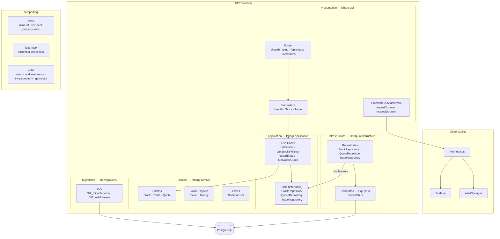
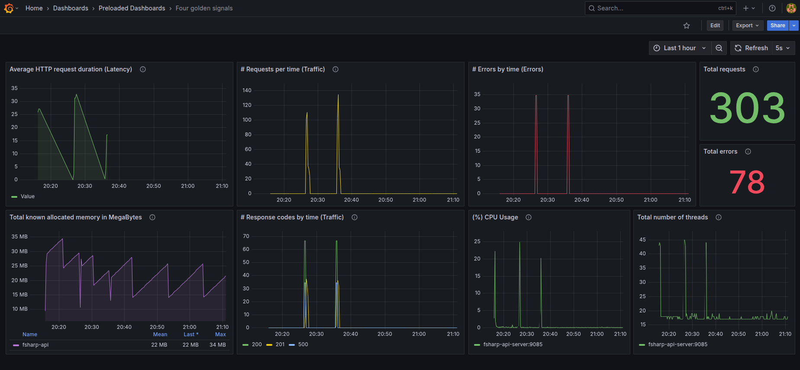
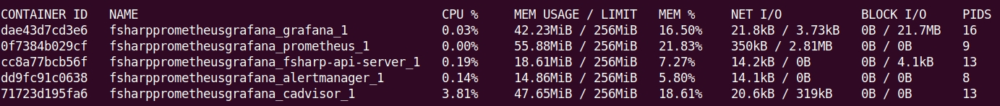

# Monitoring F# API

An F# REST API demonstrating production-grade monitoring with Prometheus, Grafana, and AlertManager. Built with ASP.NET + Giraffe following **clean architecture** principles.

* Related project: [64J0/dotnet-builtin-metrics](https://github.com/64J0/dotnet-builtin-metrics)

---

## Clean Architecture

Clean architecture organises code into concentric layers where **dependencies only point inward** — outer layers depend on inner ones, never the reverse. This is enforced through *ports* (interfaces) defined by inner layers and implemented by outer ones.

### Layers

| Layer | Project | Responsibility |
|---|---|---|
| **Domain** | `fsharp-domain` | Entities, value objects, and domain errors. Zero external dependencies. |
| **Application** | `fsharp-application` | Use-case orchestration and port interfaces. Depends only on Domain. |
| **Infrastructure** | `fsharp-infrastructure` | Database access via SqlHydra-generated types and repository implementations. |
| **Presentation** | `fsharp-api` | HTTP controllers, routing, Prometheus middleware, and DI composition root. |

### Advantages

* **Testability** — domain and application logic can be unit-tested without a database or HTTP stack.
* **Framework independence** — business rules do not depend on Giraffe, ASP.NET, or any ORM.
* **Explicit boundaries** — ports make all cross-layer dependencies visible and substitutable.
* **Separation of concerns** — each layer has a single, well-defined responsibility.

### Disadvantages

* **More boilerplate** — mapping between HTTP DTOs, domain models, and database records adds ceremony.
* **Indirection** — tracing a request across many layers can be harder for newcomers.
* **Overhead for small projects** — the layered structure can feel heavy for simple CRUD applications.

---

## Project Structure


```mermaid
graph TD
    subgraph Observability
        Prometheus
        Grafana
        AlertManager
    end

    subgraph ".NET Solution"
        subgraph "Presentation — fsharp-api"
            Router["Router\n/health · /ping · /api/stocks · /api/trades"]
            Controllers["Controllers\nHealth · Stock · Trade"]
            PMiddleware["Prometheus Middleware\nrequestCounter · requestDuration"]
        end

        subgraph "Application — fsharp-application"
            UseCases["Use Cases\nListStocks · GetStockByTicker\nRecordTrade · GetLatestQuote"]
            Ports["Ports (Interfaces)\nIStockRepository\nIQuoteRepository\nITradeRepository"]
        end

        subgraph "Domain — fsharp-domain"
            Entities["Entities\nStock · Trade · Quote"]
            ValueObjects["Value Objects\nTicker · Money"]
            DomainErrors["Errors\nDomainError"]
        end

        subgraph "Infrastructure — fsharp-infrastructure"
            Repositories["Repositories\nStockRepository · QuoteRepository\nTradeRepository"]
            SqlHydra["Generated — SqlHydra\nStocksDb.fs"]
        end

        subgraph "Migrations — db-migrations"
            Migrations["SQL\n001_InitialSchema · 002_AddIndexes"]
        end
    end

    subgraph "Supporting"
        Tests["tests/\nxUnit.v3 · FsCheck property tests"]
        LoadTest["load-test/\nNBomber stress test"]
        Utils["utils/\nscripts: make-requests · trivy-summary · gen-pass"]
    end

    Router --> Controllers
    Controllers --> UseCases
    UseCases --> Ports
    UseCases --> Entities
    Repositories -->|implements| Ports
    Repositories --> SqlHydra
    SqlHydra --> DB[(PostgreSQL)]
    Migrations --> DB

    PMiddleware --> Prometheus
    Prometheus --> Grafana
    Prometheus --> AlertManager
```

### Directory reference

| Path | Purpose |
|---|---|
| `fsharp-domain/` | Core business model — entities, value objects, error union |
| `fsharp-application/` | Use cases and port interfaces (no I/O) |
| `fsharp-infrastructure/` | Npgsql + SqlHydra repositories, generated DB types |
| `fsharp-api/` | ASP.NET / Giraffe entry point, controllers, router, middleware |
| `db-migrations/` | DbUp SQL migration runner |
| `tests/` | Unit and property-based tests |
| `load-test/` | NBomber HTTP load test |
| `prometheus/` | Prometheus config, alerting rules, TLS web config |
| `grafana/` | Provisioned datasources and dashboards |
| `utils/` | Helper scripts (`make-requests.fsx`, `trivy-summary.fsx`, `gen-pass.fsx`) |

---

## What should we monitor?

We follow Google's **four golden signals** from the [SRE book](https://sre.google/sre-book/monitoring-distributed-systems/#xref_monitoring_golden-signals):

> The four golden signals of monitoring are latency, traffic, errors, and
> saturation. If you can only measure four metrics of your user-facing system,
> focus on these four.

| Signal | Description | How to get |
|---|---|---|
| Latency | Time to service a request. | `requestDuration` custom middleware |
| Traffic | HTTP requests per second. | `requestCounter` custom middleware |
| Errors | Rate of failed requests. | Combination of both metrics |
| Saturation | How "full" the service is. | Built-in Prometheus / .NET metrics |

> **Note:** `requestDuration` measures *response time* (client-perceived), not pure service latency — it includes network and queueing delays (see *Designing Data-Intensive Applications*).

---

## API Endpoints

| Method | Path | Description |
|---|---|---|
| `GET` | `/health` | Liveness check |
| `GET` | `/ping/:name` | Echo ping |
| `GET` | `/api/stocks` | List all stocks |
| `GET` | `/api/stocks/:ticker` | Get stock by ticker symbol |
| `POST` | `/api/trades` | Record a trade execution |
| `GET` | `/openapi/v1.json` | OpenAPI document |
| `GET` | `/scalar/v1` | Scalar interactive API UI |
| `GET` | `:9085/metrics` | Prometheus metrics scrape endpoint |

---

## How to run?

### Containerised (recommended)

Make sure you have:

* `Docker version 28.1.1`
* `Docker Compose version v2.35.1`

```bash
# Start all services (API, PostgreSQL, Prometheus, Grafana)
docker compose up -d

# Or build the API image and run standalone
docker build -t fsharp-api:v1 .
docker run -d -p 8085:8085 -p 9085:9085 fsharp-api:v1
```

Prometheus is available at `http://localhost:9090`.

* The API base image uses a chiseled variant. See [this article](https://devblogs.microsoft.com/dotnet/announcing-dotnet-chiseled-containers/) for more details.

#### Grafana dashboards

Grafana auto-provisions two dashboards on startup. Access it at `http://localhost:3000`.

Default credentials:

* Username: `admin`
* Password: `admin`

Sample dashboard:



### Local development

Requires .NET SDK 10.0.

```bash
cd fsharp-api/
dotnet restore
dotnet build
dotnet run
# or: dotnet watch run
```

---

## How to test manually?

```bash
# Health check
curl localhost:8085/health
# {"message":"API instance is healthy!"}

# Ping
curl localhost:8085/ping/foo
# {"message":"Pong from foo!"}

# List stocks
curl localhost:8085/api/stocks

# Get stock by ticker
curl localhost:8085/api/stocks/AAPL

# Record a trade
curl -X POST \
    -H "Content-Type: application/json" \
    -d '{"stockId":1,"side":"BUY","quantity":10,"price":175.50,"executedAt":"2026-07-02T12:00:00Z"}' \
    localhost:8085/api/trades

# OpenAPI document
curl localhost:8085/openapi/v1.json

# Scalar interactive UI (open in a browser)
# http://localhost:8085/scalar/v1

# Prometheus metrics
curl localhost:9085/metrics
```

You can also use the `make` shortcuts:

```bash
make request-health
make request-ping
make request-stocks
make request-stock-ticker
make request-trade
```

Or send all requests in parallel with the helper script:

```bash
dotnet fsi utils/make-requests.fsx
```

---

## Load test

The load test uses [NBomber](https://nbomber.com/docs/getting-started/overview/) and runs a ramping injection scenario against the API.

```bash
make load-test
```

---

## Resource allocation

All services in `docker-compose.yml` have CPU and memory limits. To monitor live resource usage:

```bash
docker stats
```

Example:



---

## Changelog

* **June 2025** — Version 1 released.
* **July 2026** — Major AI-assisted refactoring: clean architecture, SqlHydra, Giraffe.OpenApi, Scalar, xUnit.v3, FsCheck property-based tests.
